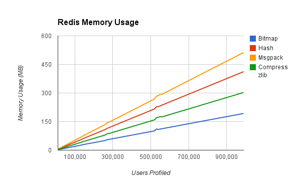
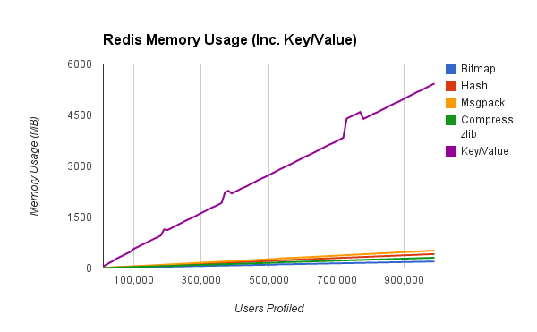

## Redis Data Structure Memory Test

### Overview

At 140 Proof we store lots of data, hundreds of millions of records that we use frequently to generate Personas. We use a variety of datastores to support the various use cases, but there's a particularly interesting use case that got us looking into various solution.

I put together a test script that generates some random data and stores the results in Redis using a number of different *strategies*.

### Use Case

In our particular use case we need to be able to store a number of Key/Value pairs for each user, but this pattern applies to any situation where you need fast access to previously computed data associated with a specific object.

### Goal

* Store interest scores for ~500 million users
* Fast retrieval
* High retrieval concurrency
* Writes can be slow

### Setup

#### Prerequisites

* Redis (2.8.17)
* Ruby (tested with 2.1.3p242)

#### Run

* Run redis-server: `redis-server`
* Run test script: `ruby redis_test.rb`

### Strategies

#### Traditional Key/Value

This strategy simply uses a compound key `<user_id>:<interest>` and stores the score as the value. This obviously results in the highest performance both in reads and writes, but also results in the highest memory usage by far (which is expected as the user_id data is heavily duplicated).

#### Bitmap

This strategy sets the key to the `user_id` and uses a bitmap to indicate whether or not a user is *interested* in a particular *interest*. Clearly there is a loss of resolution here as we no longer store a score (that indicates the measure of interest) but a boolean yes/no instead.

#### Hash

This strategy sets the key to the `user_id` and uses the Redis native Hash data structure to store a map of interests -> scores.

#### MessagePack Encoded Hash as Value

This strategy sets the key to the `user_id` and uses an internal Redis Lua script to MessagePack encode the Hash of the interests -> scores.

#### Zlib Compressed Hash as Value

This strategy sets the key to the `user_id` and uses zlib to compress the Hash of the interests -> scores client-side.

### Caveats

#### Persistance

For this test I ran Redis with persistance disabled. Generally speaking the strategies affected most negatively by persistence were those that generated a larger number of changes (and therefore resulted in writing to disk more frequently).

#### Memory Spikes

In each of the tests after roughly the same number of users have been added there's a small but noticeable jump in memory usage (clearly visible in the graph). I'm assuming that it is a result of some process within Redis.

### Results

#### Conclusion

Generally speaking, if actual scores are needed, then compressing the interest -> score hash and then storing it using the standard Redis Key/Value system uses the least amount of memory.

If you're willing to give up granular scoring, then the Bitmap strategy is best (although Writes appear to be very slow).

As expected all strategies yield massive savings over the traditional pure Key/Value based strategy.

#### Charts

### Resources

* [Test Source Code](http://github.com/ahamidi/redis-tests)
* [Tabulated Results (Google Docs)](https://docs.google.com/spreadsheets/d/1iZBB5fEuE9esgzRt-nwUkt4co5tQEuuK7dBFvU-GsR0/edit?usp=sharing)
* [Redis](http://redis.io)
